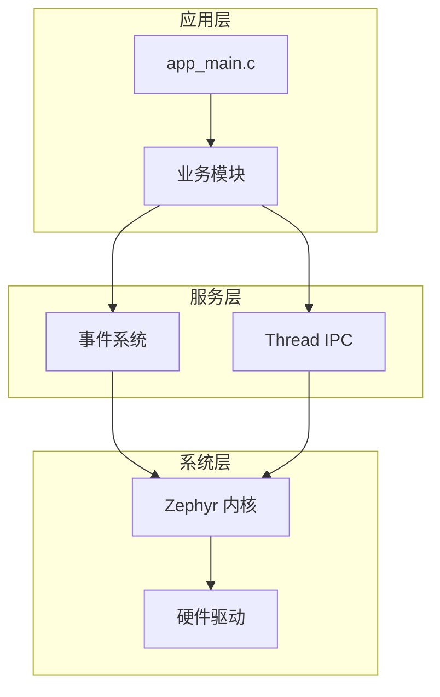

# 文档改进建议（针对新人友好度）

本文档分析当前 `docs/` 下文档的**不足之处**，并提出**具体改进建议**，帮助新人更快上手。

**分析日期**：2026-04-01  
**分析对象**：`docs/` 目录下全部 26 份文档

---

## 一、现状评估

### ✅ 做得好的地方

| 文档 | 优点 |
|------|------|
| **环境搭建与配置指南.md** | 步骤详尽，覆盖 Windows/Linux/macOS，故障排除全面 |
| **CI 平台配置保姆级手册.md** | 真正"保姆级"，逐步截图式说明 |
| **文档索引.md** | 清晰的学习路径分类（A/B/C/D/E 路径） |
| **常见问题与故障排除.md** | 高频问题覆盖全面，处理思路清晰 |
| **开发者入门指南.md** | 日常开发流程完整，检查清单实用 |

### ⚠️ 需要改进的地方

| 问题类型 | 具体表现 | 影响 |
|----------|----------|------|
| **缺少超快速入门** | 没有"5 分钟看到效果"的路径 | 新人容易在环境搭建阶段放弃 |
| **视觉内容不足** | 几乎全是文字，缺少架构图、流程图 | 抽象概念难理解 |
| **前置条件分散** | Python/West/CMake 版本要求散落在多个文档 | 新人不知道先装什么 |
| **Windows 痛点分散** | PowerShell 策略、路径格式等问题散落在各处 | Windows 用户踩坑率高 |
| **缺少"第一个 LED"教程** | 没有从零到硬件控制的完整示例 | 学完不知道如何控制硬件 |
| **术语解释不够通俗** | 如"独立应用"、"Devicetree overlay"等缺少一句话解释 | 新人理解门槛高 |
| **缺少视频/动图** | 关键步骤无视觉参考 | 操作类步骤难模仿 |

---

## 二、建议新增的文档

### 1. 📖 **5 分钟快速体验.md**（新增）

**目标读者**：想快速看看这个项目能做什么的人

**内容大纲**：
```markdown
# 5 分钟快速体验

## 前提条件（只需 2 个）
- Python 3.8+（验证：`python --version`）
- 已克隆本仓库

## 第 1 步：安装 West（1 分钟）
```bash
pip install west
```

## 第 2 步：配置路径（2 分钟）
```bash
copy zephyr_config.env.template zephyr_config.env
# 编辑文件，填入你的 Zephyr 路径（若已有）
```

## 第 3 步：构建并运行（2 分钟）
```bash
# 使用 native_posix（无需开发板）
west build -b native_posix .
# 运行编译产物
./build/zephyr/zephyr.exe
```

## 你看到了什么？
- 日志输出示例
- Shell 命令演示

## 下一步
- 阅读 [环境搭建与配置指南.md](../10-环境与构建/11-环境搭建与配置指南.md) 完成完整环境
- 阅读 [开发者入门指南.md](../00-入门/04-开发者入门指南.md) 开始开发
```

**优先级**：🔴 高（新人第一触点）

---

### 2. 📊 **项目架构可视化指南.md**（新增）

**目标读者**：想理解整体架构的视觉型学习者

**内容大纲**：
```markdown
# 项目架构可视化指南

## 1. 目录结构一图看懂
```
[使用 Mermaid 或图片展示 src/ 各目录关系]
```

## 2. 事件系统工作流程
```
[流程图：模块 A → 事件系统 → 模块 B/C/D]
```

## 3. 启动流程时序图
```
[时序图：SYS_INIT → module_manager_register → module_start]
```

## 4. 构建流程
```
[流程图：west build → CMake → Devicetree → 编译 → 链接]
```

## 5. 内存布局
```
[内存分布图：Flash | RAM | 堆 | 栈 | 分区]
```
```

**优先级**：🟡 中（帮助理解，但不影响快速开始）

---

### 3. 💡 **从零到 Blink LED.md**（新增）

**目标读者**：第一次控制硬件的新人

**内容大纲**：
```markdown
# 从零到 Blink LED

## 目标
让开发板上的 LED 闪烁（以 Nucleo L4R5 为例）

## 步骤 1：确认你的开发板
- 板载 LED 引脚查询方法
- 设备树中如何找到 LED 节点

## 步骤 2：创建你的第一个模块
```c
// src/modules/my_led.c 完整代码示例
```

## 步骤 3：配置设备树 overlay
```dts
// boards/my_board.overlay 示例
```

## 步骤 4：编译与烧录
```bash
west build -b nucleo_l4r5zi .
west flash
```

## 步骤 5：遇到问题？
- LED 不亮的可能原因
- 串口输出查看方法

## 扩展阅读
- [设备树与内存配置手册.md](../40-应用开发/44-设备树与内存配置手册.md)
- [模块系统详细使用说明.md](../30-核心模块/32-模块系统详细使用说明.md)
```

**优先级**：🔴 高（硬件开发"Hello World"）

---

### 4. 📋 **术语速查卡片.md**（新增）

**目标读者**：遇到不懂术语时快速查阅

**内容大纲**：
```markdown
# 术语速查卡片

## 构建相关
| 术语 | 一句话解释 | 典型场景 |
|------|------------|----------|
| **West** | Zephyr 的"包管理器 + 构建工具" | `west build`, `west flash` |
| **ZEPHYR_BASE** | Zephyr 源码目录的环境变量名 | 构建时找不到内核会报错 |
| **overlay** | 对开发板设备树的"补丁文件" | 扩展 SRAM、添加外设 |
| **prj.conf** | 项目的"配置文件"（启用哪些功能） | 类似菜单配置 |
| **native_posix** | 在 PC 上模拟运行 Zephyr | 无需开发板测试逻辑 |

## 代码相关
| 术语 | 一句话解释 | 典型场景 |
|------|------------|----------|
| **SYS_INIT** | Zephyr 的"自动初始化"宏 | 模块注册不用手动调用 |
| **Devicetree** | 硬件配置的"描述文件" | 告诉系统有哪些硬件 |
| **Kconfig** | 配置项的"菜单定义" | 决定 prj.conf 能写什么 |
| **event_publish** | "发送事件"的 API | 模块间通信 |
| **event_subscribe** | "订阅事件"的 API | 接收其他模块的消息 |

## 硬件相关
| 术语 | 一句话解释 | 典型场景 |
|------|------------|----------|
| **Nucleo** | ST 公司的开发板系列 | 常用测试板 |
| **UART** | 串口通信 | 打印日志到电脑 |
| **GPIO** | 通用输入输出口 | 控制 LED、读取按键 |
```

**优先级**：🟢 低（但很实用，可随时查阅）

---

## 三、建议改进的现有文档

### 1. **环境搭建与配置指南.md** 改进建议

**当前问题**：
- 前置条件列表太长，新人不知道从哪开始
- Windows 用户的 PowerShell 执行策略问题藏在后面

**改进建议**：
```diff
+ ## 0. 安装前检查清单（5 分钟）
+ 在开始之前，请确认已安装：
+ - [ ] Python 3.8+（验证：`python --version`）
+ - [ ] Git（验证：`git --version`）
+ - [ ] 文本编辑器（VSCode / Vim / 其他）
+ 
+ 若未安装，请先：
+ 1. Python: https://www.python.org/downloads/
+ 2. Git: https://git-scm.com/downloads
+ 
  ## 前提条件
  
  在配置此项目之前，请确保已安装以下内容：
  
- 1. **Zephyr SDK** - 下载地址：https://github.com/zephyrproject-rtos/zephyr-sdk
- 2. **Zephyr 源代码** - 克隆地址：https://github.com/zephyrproject-rtos/zephyr
- 3. **West** - 通过以下命令安装：`pip install west`
- 4. **CMake**（3.20.0 或更高版本）
- 5. **Python 3.8+**
+ ## 1. 一键安装脚本（推荐新手）
+ 
+ ```bash
+ # 自动安装 West、CMake、Python 依赖
+ pip install west cmake
+ ```
+ 
+ ## 2. 获取 Zephyr（二选一）
+ 
+ ### 方案 A：使用官方安装脚本（推荐）
+ [链接到 Zephyr 官方安装指南]
+ 
+ ### 方案 B：手动克隆
+ [现有内容]
```

**优先级**：🟡 中

---

### 2. **开发者入门指南.md** 改进建议

**当前问题**：
- "从模板复制后的检查清单" 太靠前，第一次阅读的人可能被吓到
- 缺少"最小可行修改"示例

**改进建议**：
```diff
  ## 快速开始
  
+ ### 30 秒测试构建
+ 
+ ```bash
+ # 假设你已有 Zephyr 环境
+ west build -b native_posix .
+ # 看到 "Built ... zephyr" 即成功
+ ```
+ 
+ ### 第一个修改：改改日志输出
+ 
+ 1. 打开 `src/app/app_main.c`
+ 2. 找到 `LOG_INF("...")`
+ 3. 改成你的话
+ 4. 重新构建，运行，看到你的输出
+ 
  ### 1. 环境配置
  
  [现有内容]
```

**优先级**：🟢 低

---

### 3. **文档索引.md** 改进建议

**当前问题**：
- 阅读路径虽然清晰，但缺少"预计时间"
- 新人不知道每条路径要花多久

**改进建议**：
```diff
  ### 路径 A：第一次编译本工程（零基础）
  
  0. （若本仓库**复制为新项目**）先看根目录 **[README.md](../../README.md)** 中的「从本模板初始化新项目（检查清单）」与 **[开发者入门指南.md](../00-入门/04-开发者入门指南.md#从模板复制后的检查清单)**，完成 west、CMake、CI 板型等对齐。
  1. **[环境搭建与配置指南.md](../10-环境与构建/11-环境搭建与配置指南.md)** — 安装 Zephyr SDK、West、CMake、Python；配置 **`zephyr_config.env`**；验证 **`west build`** 能通过。
+    ⏱️ 预计时间：首次 1-2 小时（含下载），后续 10 分钟
+ 
  2. **[独立应用构建说明.md](../10-环境与构建/12-独立应用构建说明.md)** — 理解「独立应用」目录结构、**`ZEPHYR_BASE`**、**`west build`** 常用参数；自定义板与 overlay 的约定。
+    ⏱️ 预计时间：30 分钟
+ 
  3. 如需**更换开发板**：**[板型迁移指南.md](../10-环境与构建/13-板型迁移指南.md)** — 完整的板型迁移流程、设备树调整、内存配置、CI 更新。
+    ⏱️ 预计时间：1 小时（首次）
+ 
  4. **[开发者入门指南.md](../00-入门/04-开发者入门指南.md)** — 项目目录、`prj.conf` / `Kconfig` 分工、添加模块与事件的最短流程。
+    ⏱️ 预计时间：1 小时
```

**优先级**：🟢 低（但很贴心）

---

### 4. **常见问题与故障排除.md** 改进建议

**当前问题**：
- 缺少"错误信息 → 可能原因 → 解决方案"的快速索引
- Windows 特有问题不够突出

**改进建议**：
```diff
+ ## 快速索引（按错误信息）
+ 
+ | 错误信息 | 可能原因 | 解决方案 |
+ |----------|----------|----------|
+ | `ZEPHYR_BASE not set` | 未配置环境变量 | [链接](#11-zephyr_base_not_set) |
+ | `region RAM overflowed` | 内存不足 | [链接](#21-region-ram-overflowed) |
+ | `'west' is not recognized` | 未安装或未激活 venv | [链接](#12-终端里找不到 west) |
+ | `Board 'xxx' not found` | 板型未识别 | [链接](#23-board-xxx-not-found) |
+ 
  ## 1. 环境与路径
  
  ### 1.1 `ZEPHYR_BASE not set` / 找不到 Zephyr
  
  [现有内容]
```

**优先级**：🟡 中

---

## 四、其他改进建议

### 1. 在根目录 README 添加"新人从这里开始"

```markdown
## 🚀 新人从这里开始

| 我想... | 阅读文档 | 预计时间 |
|---------|----------|----------|
| **5 分钟看看效果** | [docs/zh-CN/00-入门/01-5分钟快速体验.md](docs/zh-CN/00-入门/01-5分钟快速体验.md) | 5 分钟 |
| **正式搭建环境** | [docs/zh-CN/10-环境与构建/11-环境搭建与配置指南.md](docs/zh-CN/10-环境与构建/11-环境搭建与配置指南.md) | 1-2 小时 |
| **开始写代码** | [docs/zh-CN/00-入门/04-开发者入门指南.md](docs/zh-CN/00-入门/04-开发者入门指南.md) | 1 小时 |
| **控制硬件（LED）** | [docs/zh-CN/00-入门/04-开发者入门指南.md](docs/zh-CN/00-入门/04-开发者入门指南.md) | 30 分钟 |
| **查术语** | [docs/zh-CN/00-入门/03-术语速查卡片.md](docs/zh-CN/00-入门/03-术语速查卡片.md) | 随时 |
```

**优先级**：🔴 高（新人第一触点）

---

### 2. 添加架构图到 README

在根目录 README 的"架构概览"一节添加 Mermaid 图：

```markdown
## 架构概览


```

**优先级**：🟢 低（但很酷）

---

### 3. 创建"新人入门包"检查清单

在 `.github/` 或 `docs/` 下创建：

```markdown
# 新人入门包检查清单

## 第 1 天
- [ ] 克隆仓库
- [ ] 运行 `5 分钟快速体验`
- [ ] 阅读 [文档索引.md](../00-入门/02-文档索引.md)

## 第 1 周
- [ ] 完成 [环境搭建与配置指南.md](../10-环境与构建/11-环境搭建与配置指南.md)
- [ ] 成功编译 `native_posix`
- [ ] 成功编译目标开发板
- [ ] 烧录并看到串口输出

## 第 1 月
- [ ] 完成 [从零到 Blink LED.md](从零到 Blink LED.md)
- [ ] 添加自己的第一个模块
- [ ] 理解事件系统工作原理
- [ ] 参与一次代码评审
```

**优先级**：🟢 低（但有助于长期 onboarding）

---

## 五、优先级总结

| 改进项 | 优先级 | 预计工作量 | 影响力 |
|--------|--------|------------|--------|
| **新增：5 分钟快速体验.md** | 🔴 高 | 1 小时 | 🔴 高 |
| **新增：从零到 Blink LED.md** | 🔴 高 | 2 小时 | 🔴 高 |
| **改进：根目录 README 添加新人入口** | 🔴 高 | 30 分钟 | 🔴 高 |
| **新增：项目架构可视化指南.md** | 🟡 中 | 2 小时 | 🟡 中 |
| **改进：环境搭建指南前置检查清单** | 🟡 中 | 30 分钟 | 🟡 中 |
| **改进：常见问题快速索引** | 🟡 中 | 30 分钟 | 🟡 中 |
| **新增：术语速查卡片.md** | 🟢 低 | 1 小时 | 🟢 中 |
| **改进：文档索引添加预计时间** | 🟢 低 | 30 分钟 | 🟢 低 |
| **新增：新人入门包检查清单** | 🟢 低 | 30 分钟 | 🟢 低 |

---

## 六、实施建议

### 阶段 1（立即实施，1 天内完成）
1. 创建 **5 分钟快速体验.md**
2. 更新根目录 **README.md** 添加"新人从这里开始"表格
3. 在 **环境搭建与配置指南.md** 开头添加"安装前检查清单"

### 阶段 2（1 周内完成）
1. 创建 **从零到 Blink LED.md**
2. 在 **常见问题与故障排除.md** 添加快速索引表
3. 创建 **术语速查卡片.md**

### 阶段 3（1 月内完成）
1. 创建 **项目架构可视化指南.md**（含 Mermaid 图）
2. 在 **文档索引.md** 添加预计时间
3. 创建 **新人入门包检查清单**

---

*本文档由 AI 分析生成，具体实施时请根据项目实际情况调整。*
